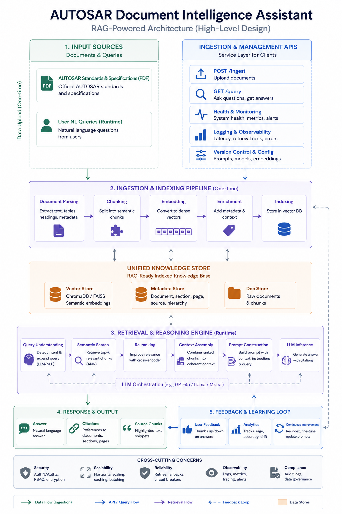

# AUTOSAR Document Intelligence Assistant

> A **Retrieval-Augmented Generation (RAG)** system for intelligent querying of AUTOSAR Basic Software (BSW) standards and specifications.

**Course:** AIMLCZG546 — Software Engineering for Machine Learning | **Group:** 151 | **BITS Pilani WILP**

| # | Name | BITS ID | Email |
|---|------|---------|-------|
| 1 | Abhinav Mandloi | 2025aa05473 | 2025aa05473@wilp.bits-pilani.ac.in |
| 2 | Pritish Joshi | 2025aa05686 | 2025aa05686@wilp.bits-pilani.ac.in |
| 3 | Satwinder Singh | 2025aa05553 | 2025aa05553@wilp.bits-pilani.ac.in |
| 4 | Shray Vijay | 2025aa05533 | 2025aa05533@wilp.bits-pilani.ac.in |

[](https://www.python.org/)
[](https://fastapi.tiangolo.com/)
[](https://ollama.ai/)
[](https://www.trychroma.com/)

---

## 📋 Table of Contents

1. [Problem Statement](#problem-statement)
2. [Why Machine Learning?](#why-machine-learning)
3. [System Overview](#system-overview)
4. [High-Level Design (HLD)](#high-level-design-hld)
5. [Implementation Phases](#implementation-phases)
6. [Architecture Patterns](#architecture-patterns)
7. [Quality Requirements](#quality-requirements)
8. [Measurable Goals](#measurable-goals)
9. [Tech Stack](#tech-stack)
10. [Getting Started](#getting-started)
11. [API Reference](#api-reference)
12. [Project Structure](#project-structure)

---

## Problem Statement

AUTOSAR (AUTomotive Open System ARchitecture) specifications are **massive**, highly technical documents spanning thousands of pages across dozens of BSW modules (Com, NvM, Dem, Os, etc.). Embedded systems engineers frequently need to:

- Look up specific configuration parameters across multiple PDFs
- Understand inter-module dependencies (e.g., Com ↔ PduR ↔ CanIf)
- Find exact API signatures and their behavioral specifications
- Cross-reference requirements between AUTOSAR versions

**The manual process is extremely time-consuming and error-prone.** A single query like *"What is the Com stack configuration for PDU routing?"* might require searching through 5+ documents, each 200+ pages.

### Solution

The **AUTOSAR Document Intelligence Assistant** ingests AUTOSAR specification PDFs, parses and chunks them semantically, creates vector embeddings, and enables natural language querying with **precise, citation-backed answers** powered by a local LLM (via Ollama).

---

## Why Machine Learning?

| Criterion | Justification |
|-----------|---------------|
| **Volume** | AUTOSAR specifications exceed 10,000+ pages — far beyond human capacity for rapid lookup |
| **Prediction Task** | Semantic search is fundamentally a relevance scoring/prediction problem — the embedding model predicts similarity between a query and document chunks |
| **Pattern Recognition** | LLMs recognize patterns in technical language to generate coherent, contextual answers |
| **Continuous Improvement** | The feedback loop enables the system to improve retrieval quality over time via re-ranking optimization |
| **No Deterministic Solution** | Natural language understanding cannot be solved with simple keyword matching or regex — it requires learned representations |

---

## System Overview

The system follows a **5-stage pipeline architecture**:

```
┌─────────────────┐     ┌─────────────────────────┐     ┌──────────────────────┐
│  1. INPUT       │     │  2. INGESTION &          │     │  UNIFIED KNOWLEDGE   │
│  SOURCES        │────▶│     INDEXING PIPELINE    │────▶│  STORE               │
│  (PDFs, Queries)│     │  (Parse→Chunk→Embed→     │     │  (Vector + Metadata  │
│                 │     │   Enrich→Index)           │     │   + Doc Store)       │
└─────────────────┘     └─────────────────────────┘     └──────────┬───────────┘
                                                                    │
                                                                    ▼
┌─────────────────┐     ┌─────────────────────────┐     ┌──────────────────────┐
│  4. RESPONSE &  │     │  3. RETRIEVAL &          │     │  Query Understanding │
│     OUTPUT      │◀────│     REASONING ENGINE     │◀────│  → Semantic Search   │
│  (Answer +      │     │  (Re-rank→Assemble→      │     │  → Re-ranking        │
│   Citations)    │     │   Prompt→LLM Inference)  │     │                      │
└────────┬────────┘     └─────────────────────────┘     └──────────────────────┘
         │
         ▼
┌─────────────────┐
│  5. FEEDBACK &  │
│     LEARNING    │
│     LOOP        │
└─────────────────┘
```

---

## High-Level Design (HLD)



The HLD comprises five core layers plus cross-cutting concerns:

| Layer | Purpose | Key Components |
|-------|---------|----------------|
| **1. Input Sources** | Raw data ingestion point | AUTOSAR PDFs, User NL Queries |
| **2. Ingestion & Indexing** | One-time document processing | Document Parser, Chunker, Embedding Model, Enrichment, Indexer |
| **3. Retrieval & Reasoning** | Runtime query processing | Query Understanding, Semantic Search, Re-ranker, Context Assembly, Prompt Builder, LLM |
| **4. Response & Output** | Answer delivery | Natural language answer, Citations, Source chunks |
| **5. Feedback Loop** | Continuous improvement | User feedback, Analytics, Re-indexing triggers |
| **Cross-Cutting** | System-wide concerns | Security, Scalability, Reliability, Observability, Compliance |
| **API Layer** | Client interface | POST /ingest, GET /query, Health & Monitoring endpoints |

---

## Implementation Phases

The project is organized into **5 phases**, each building on the previous one. Each phase is self-contained with clear deliverables and acceptance criteria.

---

### 🔷 Phase 1: Foundation & Infrastructure Setup
**Duration:** Day 1–2 | **Priority:** Critical

**Objective:** Set up the project skeleton, install dependencies, configure Ollama with appropriate models, and establish the development environment.

**Tasks:**
- [ ] Initialize Python project with `pyproject.toml` or `requirements.txt`
- [ ] Install and configure **Ollama** with embedding model (`nomic-embed-text`) and LLM (`llama3.2` or `mistral`)
- [ ] Set up **FastAPI** application scaffold with CORS, error handling, and logging
- [ ] Configure **ChromaDB** as the vector store (persistent storage)
- [ ] Create the project directory structure (see [Project Structure](#project-structure))
- [ ] Set up environment configuration (`.env` file for model names, chunk sizes, etc.)
- [ ] Implement basic health check endpoint (`GET /health`)

**Deliverables:**
- Running FastAPI server with health endpoint
- Ollama serving both embedding and LLM models locally
- ChromaDB initialized with persistent storage
- Logging infrastructure (structured JSON logs)

**Acceptance Criteria:**
- `GET /health` returns `200 OK` with model availability status
- Ollama responds to both embedding and completion requests
- ChromaDB can create/read collections

---

### 🔷 Phase 2: Document Ingestion Pipeline
**Duration:** Day 2–4 | **Priority:** Critical

**Objective:** Build the complete document ingestion pipeline — from PDF upload through parsing, chunking, embedding, enrichment, and indexing into the vector store.

**Tasks:**
- [ ] **Document Parser**: Implement PDF text extraction using `PyMuPDF` (fitz)
  - Extract text, tables, headings, and metadata (title, page numbers)
  - Handle multi-column layouts and embedded tables
  - Preserve section hierarchy from AUTOSAR document structure
- [ ] **Chunking Strategy**: Implement semantic chunking
  - Split by AUTOSAR section headings (e.g., `7.1.2 Com_Init`, `[SWS_Com_00432]`)
  - Configurable chunk size (default: 512 tokens) with overlap (default: 50 tokens)
  - Preserve requirement IDs (SWS tags) within chunks
- [ ] **Embedding Pipeline**: Generate dense vector embeddings
  - Use Ollama's `nomic-embed-text` model (768-dim vectors)
  - Batch processing for efficiency
- [ ] **Enrichment**: Attach metadata to each chunk
  - Source document name, page number, section hierarchy
  - AUTOSAR module name, requirement IDs found in chunk
  - Chunk index and relationship to adjacent chunks
- [ ] **Indexing**: Store enriched embeddings in ChromaDB
  - Create collection with cosine similarity metric
  - Store vectors + metadata + original text
- [ ] **API Endpoint**: `POST /ingest`
  - Accept PDF file upload (multipart/form-data)
  - Return ingestion status, chunk count, and processing time
  - Idempotent: re-ingesting same document replaces old embeddings

**Deliverables:**
- Working `/ingest` endpoint that processes AUTOSAR PDFs end-to-end
- Populated ChromaDB with searchable embeddings
- Ingestion logs showing parsing stats (pages, chunks, time)

**Acceptance Criteria:**
- A 200-page AUTOSAR PDF is ingested in < 5 minutes
- Chunks preserve section structure and requirement IDs
- ChromaDB contains correctly indexed embeddings with metadata

---

### 🔷 Phase 3: Retrieval & Reasoning Engine (RAG Core)
**Duration:** Day 4–6 | **Priority:** Critical

**Objective:** Build the runtime query pipeline — from natural language question to retrieved context to LLM-generated answer with citations.

**Tasks:**
- [ ] **Query Understanding**: Preprocess and expand user queries
  - Clean and normalize query text
  - Optional: use LLM to expand ambiguous queries (e.g., "Com stack" → "Communication stack module PduR CanIf")
- [ ] **Semantic Search**: Retrieve top-k relevant chunks from ChromaDB
  - Embed user query using same embedding model
  - Retrieve top-k (default k=10) nearest neighbors via cosine similarity
  - Return chunks with similarity scores
- [ ] **Re-ranking**: Improve retrieval precision
  - Implement cross-encoder re-ranking using the LLM itself
  - Score each retrieved chunk for relevance to the query
  - Select top-5 after re-ranking
- [ ] **Context Assembly**: Combine ranked chunks into coherent context
  - Order chunks by document position (not just relevance)
  - Deduplicate overlapping chunks
  - Add section headers for context boundaries
- [ ] **Prompt Construction**: Build the final prompt for the LLM
  - System prompt with AUTOSAR domain instructions
  - Injected context with source attribution markers
  - User query with instruction to cite sources
  - Anti-hallucination guardrails in prompt
- [ ] **LLM Inference**: Generate answer via Ollama
  - Stream response for low-latency UX
  - Extract citations from generated text
  - Compute confidence score based on retrieval similarity
- [ ] **API Endpoint**: `GET /query` (or `POST /query`)
  - Accept: `{ "question": "...", "top_k": 5 }`
  - Return: `{ "answer": "...", "citations": [...], "confidence": 0.87, "latency_ms": 1200 }`

**Deliverables:**
- Working `/query` endpoint with full RAG pipeline
- Answers with inline citations referencing source documents, pages, and sections
- Confidence scoring for each answer

**Acceptance Criteria:**
- Search-only retrieval returns relevant chunks in under 1 second on the prepared local vector store; full answer generation depends on the local Ollama model/runtime and was measured at about 21.7 seconds in the final smoke test.
- Citations correctly reference source documents and page numbers
- Retrieval precision@5 ≥ 85% on test queries

---

### 🔷 Phase 4: Microservices Architecture & Cross-Cutting Concerns
**Duration:** Day 6–8 | **Priority:** High

**Objective:** Refactor the monolith into a microservices architecture, implement the heartbeat tactic, add observability, and address cross-cutting concerns.

**Tasks:**
- [ ] **Microservices Decomposition**:
  - **Ingestion Service**: Handles PDF upload, parsing, chunking, embedding
  - **Retrieval Service**: Handles query processing, semantic search, re-ranking
  - **LLM Inference Service**: Manages Ollama interaction, prompt construction, response generation
  - Inter-service communication via REST APIs
- [ ] **Heartbeat Tactic Implementation**:
  - Health check endpoints on each microservice (`/health`)
  - Periodic heartbeat monitoring (every 30s)
  - Alert on service degradation (embedding model unresponsive, LLM timeout)
  - Circuit breaker pattern for Ollama calls
- [ ] **Observability & Logging**:
  - Structured logging with correlation IDs across services
  - Metrics collection: query latency, retrieval scores, LLM token usage
  - Request tracing across the RAG pipeline
- [ ] **Version Control for Configs**:
  - Prompt templates versioned in config files
  - Embedding model version tracked per document
  - Chunking parameters logged with each ingestion run
- [ ] **Error Handling & Reliability**:
  - Retry logic with exponential backoff for Ollama calls
  - Graceful degradation: return cached answers if LLM is down
  - Input validation and sanitization

**Deliverables:**
- Microservices running as separate processes (or at minimum, clearly separated modules with independent APIs)
- Health dashboard showing service status
- Structured logs with full request tracing

**Acceptance Criteria:**
- Each service has independent `/health` endpoint
- Heartbeat monitor detects and reports service failures within 60s
- Logs include correlation IDs across the full query lifecycle

---

### 🔷 Phase 5: Feedback Loop, Testing & Documentation
**Duration:** Day 8–10 | **Priority:** Medium

**Objective:** Implement the feedback loop for continuous improvement, write comprehensive tests, and produce the final assignment documentation.

**Tasks:**
- [ ] **Feedback Loop**:
  - `POST /feedback` endpoint: accept thumbs up/down on answers
  - Store feedback with query-answer-context triples
  - Analytics dashboard: track accuracy, usage patterns, common queries
  - Confidence scoring and retrieval optimization based on feedback
- [ ] **Testing**:
  - Unit tests for chunking, embedding, and retrieval components
  - Integration tests for end-to-end RAG pipeline
  - Test suite with 10+ sample AUTOSAR queries and expected answer patterns
  - Performance benchmarks (latency, throughput)
- [ ] **Assignment Documentation (Objective 1)**:
  - GR4ML Requirements Specification
  - Business View diagram
  - Analytics Design View diagram
  - Data Preparation View diagram
  - Top 3 Quality Requirements with justification
- [ ] **Assignment Documentation (Objective 2)**:
  - System Architecture Diagram (HLD)
  - Architectural Pattern 1: RAG Pattern — explanation + code
  - Architectural Pattern 2: Microservices Pattern — explanation + code
  - Screenshots of working system
- [ ] **Demo Preparation**:
  - Prepare 5 sample queries demonstrating system capabilities
  - Record screenshots of ingestion and query workflows
  - Document any limitations and future enhancements

**Deliverables:**
- Feedback collection and analytics
- Test suite with ≥ 80% code coverage
- Complete assignment report (PDF/DOCX)
- Working demo with sample AUTOSAR documents

**Acceptance Criteria:**
- All tests pass
- Assignment report covers all 7 questions from both objectives
- System handles at least 3 AUTOSAR specification PDFs

---

## Architecture Patterns

### Pattern 1: Retrieval-Augmented Generation (RAG)

The RAG pattern decouples **knowledge** (stored in the vector database) from **reasoning** (performed by the LLM). This addresses the fundamental limitation of LLMs — they cannot reliably answer questions about domain-specific documents they weren't trained on.

```
┌──────────────┐     ┌──────────────┐     ┌──────────────┐
│   User       │     │   Retriever  │     │   Generator  │
│   Query      │────▶│   (Semantic  │────▶│   (LLM via   │
│              │     │    Search)   │     │    Ollama)   │
└──────────────┘     └──────┬───────┘     └──────┬───────┘
                            │                     │
                     ┌──────▼───────┐     ┌──────▼───────┐
                     │  Vector DB   │     │  Grounded    │
                     │  (ChromaDB)  │     │  Answer +    │
                     │              │     │  Citations   │
                     └──────────────┘     └──────────────┘
```

**Why RAG?**
- Eliminates hallucination by grounding answers in retrieved documents
- No fine-tuning needed — works with any off-the-shelf LLM
- Knowledge is easily updatable (re-ingest new document versions)
- Provides explainability via citations

### Pattern 2: Microservices Architecture

The system is decomposed into independent services that can be developed, deployed, and scaled independently.

```
┌──────────────────────────────────────────────────┐
│                  API Gateway                      │
│    POST /ingest    GET /query    GET /health      │
└──────┬──────────────┬──────────────┬──────────────┘
       │              │              │
       ▼              ▼              ▼
┌──────────┐   ┌──────────┐   ┌──────────┐
│ Ingestion│   │ Retrieval│   │  LLM     │
│ Service  │   │ Service  │   │ Inference│
│          │   │          │   │ Service  │
└──────────┘   └──────────┘   └──────────┘
       │              │              │
       ▼              ▼              ▼
┌──────────────────────────────────────────────────┐
│              Shared Data Layer                    │
│   ChromaDB  │  Metadata Store  │  Doc Store      │
└──────────────────────────────────────────────────┘
```

**Why Microservices?**
- **Independent scaling**: Ingestion is CPU-bound; retrieval is I/O-bound; LLM is GPU-bound
- **Fault isolation**: LLM service failure doesn't break document ingestion
- **Technology flexibility**: Each service can use optimal tools
- **Heartbeat Tactic**: Each service exposes `/health` for monitoring

---

## Quality Requirements

### 1. Accuracy (Retrieval Precision)
> *The system shall achieve retrieval precision@5 ≥ 85% for AUTOSAR domain queries.*

**Justification:** The primary value of the system is providing **correct, relevant answers**. Poor retrieval quality means the LLM generates answers from irrelevant context, leading to wrong technical information — dangerous in safety-critical automotive software.

### 2. Explainability (Citation Transparency)
> *Every answer shall include verifiable citations to source documents, sections, and page numbers.*

**Justification:** Engineers must be able to **verify** answers against the original specification. This is non-negotiable in automotive software where decisions have safety implications. The hallucination rate target is < 5%.

### 3. Availability (System Reliability)
> *The system shall maintain 99% uptime with graceful degradation when individual services fail.*

**Justification:** Engineers rely on this tool during active development sprints. Downtime disrupts workflow. The heartbeat tactic and circuit breaker pattern ensure the system degrades gracefully rather than failing completely.

---

## Measurable Goals

| Metric | Target | Measurement Method |
|--------|--------|-------------------|
| Retrieval Precision@5 | ≥ 85% | Manual evaluation on 50 test queries |
| Retrieval Latency (`/query/search`) | < 1 second | Local smoke test returned top-3 chunks in about 428 ms |
| Full Answer Latency (`/query`) | Local-LLM dependent | Final smoke test with `llama3.2` generated a cited answer in about 21.7 seconds |
| Hallucination Rate | < 5% | Manual review of 50 answers for unsupported claims |
| Ingestion Throughput | < 5 min / 200-page PDF | Timed ingestion runs |
| System Uptime | ≥ 99% | Heartbeat monitoring over 7-day period |
| Citation Accuracy | ≥ 90% | Manual verification of cited page/section numbers |

---

## Tech Stack

| Component | Technology | Justification |
|-----------|-----------|---------------|
| **Language** | Python 3.10+ | Rich ML/NLP ecosystem, FastAPI compatibility |
| **API Framework** | FastAPI | Async support, auto-docs (Swagger), type validation |
| **LLM Runtime** | Ollama | Local inference, no API costs, privacy-preserving |
| **LLM Model** | Llama 3.2 / Mistral 7B | Strong instruction-following, fits on consumer GPU |
| **Embedding Model** | nomic-embed-text (via Ollama) | High-quality embeddings, 768-dim, local inference |
| **Vector Store** | ChromaDB | Lightweight, Python-native, persistent storage |
| **PDF Parsing** | PyMuPDF (fitz) | Fast, accurate text/table extraction |
| **Logging** | Python `logging` + structlog | Structured JSON logs with correlation IDs |
| **Testing** | pytest | Standard Python testing framework |
| **Config** | python-dotenv | Environment-based configuration |

---

## Getting Started

### Prerequisites

```bash
# Install Ollama (macOS)
brew install ollama

# Pull required models
ollama pull nomic-embed-text
ollama pull llama3.2
# OR
ollama pull mistral
```

### Installation

```bash
# Clone and setup
cd Assignment_1
pip install -r requirements.txt

# Configure environment
cp .env.example .env
# Edit .env with your preferred settings

# Start the server
python -m uvicorn app.main:app --reload --port 8000
```

### Quick Start

```bash
# 1. Check system health
curl http://localhost:8000/health

# 2. Ingest an AUTOSAR PDF
curl -X POST http://localhost:8000/ingest \
  -F "file=@AUTOSAR_SWS_COM.pdf"

# 3. Ask a question
curl -X POST http://localhost:8000/query \
  -H "Content-Type: application/json" \
  -d '{"question": "What is the Com stack configuration for PDU routing?"}'
```

---

## API Reference

### `GET /health`
Health check with service status.

**Response:**
```json
{
  "status": "healthy",
  "services": {
    "embedding_model": "available",
    "llm_model": "available",
    "vector_store": "available"
  },
  "uptime_seconds": 3600
}
```

### `POST /ingest`
Upload and process an AUTOSAR PDF.

**Request:** `multipart/form-data` with `file` field

**Response:**
```json
{
  "status": "success",
  "document": "AUTOSAR_SWS_COM.pdf",
  "chunks_created": 342,
  "pages_processed": 215,
  "processing_time_seconds": 45.2
}
```

### `POST /query`
Ask a natural language question about ingested documents.

**Request:**
```json
{
  "question": "What is the Com stack configuration for PDU routing?",
  "top_k": 5
}
```

**Response:**
```json
{
  "answer": "The Com stack configuration for PDU routing involves...",
  "citations": [
    {
      "document": "AUTOSAR_SWS_COM.pdf",
      "page": 42,
      "section": "7.3.2 PDU Router Configuration",
      "relevance_score": 0.94
    }
  ],
  "confidence": 0.87,
  "latency_ms": 21735
}
```

### `POST /feedback`
Submit feedback on an answer.

**Request:**
```json
{
  "query_id": "abc-123",
  "rating": "thumbs_up",
  "comment": "Accurate answer with correct citations"
}
```

---

## Project Structure

```
Assignment_1/
├── README.md                     # This file
├── 151.ipynb                     # Assignment implementation notebook
├── 151.docx / 151.pdf            # Final submission report
├── requirements.txt              # Python dependencies
├── .env.example                  # Environment configuration template
├── .env                          # Local environment config (gitignored)
│
├── app/                          # Main application package
│   ├── __init__.py
│   ├── main.py                   # FastAPI app entry point & API gateway
│   ├── config.py                 # Configuration management
│   │
│   ├── services/                 # Microservice modules
│   │   ├── __init__.py
│   │   ├── ingestion/            # Ingestion Service
│   │   │   ├── __init__.py
│   │   │   ├── router.py         # /ingest API routes
│   │   │   ├── parser.py         # PDF text extraction
│   │   │   ├── chunker.py        # Semantic chunking logic
│   │   │   └── embedder.py       # Embedding generation via Ollama
│   │   │
│   │   ├── retrieval/            # Retrieval Service
│   │   │   ├── __init__.py
│   │   │   ├── router.py         # /query API routes
│   │   │   ├── search.py         # Semantic search (ChromaDB)
│   │   │   ├── reranker.py       # Cross-encoder re-ranking
│   │   │   └── context.py        # Context assembly
│   │   │
│   │   └── inference/            # LLM Inference Service
│   │       ├── __init__.py
│   │       ├── prompt.py         # Prompt construction & templates
│   │       ├── llm.py            # Ollama LLM interaction
│   │       └── citations.py      # Citation extraction
│   │
│   ├── storage/                  # Data layer
│   │   ├── __init__.py
│   │   ├── vector_store.py       # ChromaDB operations
│   │   └── metadata_store.py     # Document metadata management
│   │
│   ├── monitoring/               # Cross-cutting concerns
│   │   ├── __init__.py
│   │   ├── health.py             # Health checks & heartbeat
│   │   ├── logging_config.py     # Structured logging setup
│   │   └── metrics.py            # Metrics collection
│   │
│   └── feedback/                 # Feedback loop
│       ├── __init__.py
│       ├── router.py             # /feedback API routes
│       └── analytics.py          # Usage analytics
│
├── tests/                        # Test suite
│   ├── __init__.py
│   ├── test_parser.py
│   ├── test_chunker.py
│   ├── test_search.py
│   ├── test_rag_pipeline.py
│   └── test_health.py
│
├── prompts/                      # Versioned prompt templates
│   ├── system_prompt_v1.txt
│   └── query_prompt_v1.txt
│
├── data/                         # Data directory
│   ├── raw/                      # Uploaded PDFs
│   └── chroma_db/                # ChromaDB persistent storage
│
├── docs/                         # Assignment documentation
│   ├── GR4ML_Requirements.md     # GR4ML requirement specifications
│   ├── Business_View.md          # Business View diagram
│   ├── Analytics_Design_View.md  # Analytics Design View diagram
│   ├── Data_Preparation_View.md  # Data Preparation View diagram
│   └── Quality_Requirements.md   # Top 3 quality requirements
│
└── docs/                         # Assignment documentation and GR4ML views
```

---

## GR4ML Views (Assignment Objective 1)

### Business View
**Stakeholders:** Embedded Systems Engineers, AUTOSAR Integrators, Technical Leads, QA Teams  
**Business Goal:** Reduce AUTOSAR specification lookup time by 80%  
**ML Justification:** Semantic understanding of technical documents requires learned representations that cannot be achieved with keyword search alone.

### Analytics Design View
**Input:** Natural language query (text string)  
**ML Pipeline:** Query → Embedding → Similarity Search → Re-ranking → Context Assembly → LLM Inference  
**Output:** Structured answer with citations and confidence score  
**Model:** Dual-model architecture — embedding model (nomic-embed-text) for retrieval + LLM (llama3.2) for generation

### Data Preparation View
**Raw Data:** AUTOSAR BSW specification PDFs (SWS documents)  
**Preprocessing:** PDF parsing → text extraction → section identification → semantic chunking  
**Feature Engineering:** Text → dense vector embeddings (768-dim) via neural embedding model  
**Storage:** ChromaDB vector store with metadata enrichment (document, page, section, requirement IDs)

---

## License

This project is developed as part of the BITS Pilani WILP course **AIMLCZG546 — Software Engineering for Machine Learning**, Assignment I.

---

*Built with ❤️ for making AUTOSAR specifications actually searchable.*
