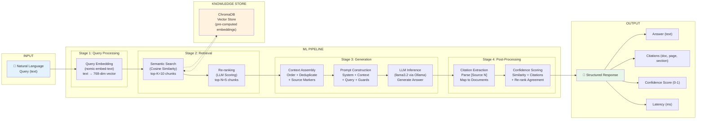

# GR4ML — Analytics Design View

## AUTOSAR Document Intelligence Assistant

---

## Analytics Design View Diagram

---

## Input Specification

| Attribute | Details |
|-----------|---------|
| **Input Type** | Natural language text string |
| **Format** | JSON: `{"question": "...", "top_k": 5}` |
| **Constraints** | 3-2000 characters, UTF-8 encoded |
| **Examples** | "What is the Com stack configuration for PDU routing?" |
| | "Explain the NvM block configuration parameters" |
| | "What are the error detection mechanisms in the Dem module?" |

---

## ML Models

### Model 1: Embedding Model (nomic-embed-text)

| Attribute | Value |
|-----------|-------|
| **Purpose** | Convert text to dense vector representations for similarity search |
| **Architecture** | Transformer-based text encoder |
| **Output Dimensions** | 768 |
| **Similarity Metric** | Cosine similarity |
| **Deployment** | Local via Ollama (no API costs) |
| **Used In** | Both ingestion (document chunks) and query (user questions) |

**How it works:** The embedding model maps semantically similar texts to nearby points in a 768-dimensional vector space. When a user queries "Com stack configuration", its embedding is close to chunks containing "Communication module configuration parameters" — even though the words differ.

### Model 2: Large Language Model (llama3.2)

| Attribute | Value |
|-----------|-------|
| **Purpose** | Generate coherent answers from retrieved context; Score chunk relevance for re-ranking |
| **Architecture** | Decoder-only transformer (3B parameters) |
| **Input** | System prompt + retrieved context + user query |
| **Output** | Natural language answer with [Source N] citations |
| **Temperature** | 0.1 (near-deterministic for factual accuracy) |
| **Deployment** | Local via Ollama |

**Anti-hallucination guardrails in prompt:**
- "ONLY answer based on the provided context passages"
- "Do NOT use prior knowledge"
- "If context is insufficient, explicitly state that"
- "Always cite sources using [Source N] notation"

---

## Output Specification

| Field | Type | Description |
|-------|------|-------------|
| `answer` | string | Natural language answer with inline [Source N] citations |
| `citations` | array | List of source references: `{document, page, section, relevance_score}` |
| `confidence` | float (0-1) | Weighted score: 40% retrieval similarity + 30% citation coverage + 30% re-rank agreement |
| `latency_ms` | float | End-to-end processing time in milliseconds |
| `chunks_retrieved` | int | Number of chunks from initial search |
| `chunks_after_rerank` | int | Number of chunks after re-ranking |
| `model_used` | string | Name of the LLM model used |

---

## Pipeline Stages Detail

### Stage 1: Query Embedding
- **Input:** Raw query text
- **Process:** Embed using nomic-embed-text via Ollama API
- **Output:** 768-dimensional dense vector
- **Latency:** ~50ms

### Stage 2: Semantic Search
- **Input:** Query embedding vector
- **Process:** Cosine similarity search against ChromaDB (HNSW index)
- **Output:** Top-10 nearest chunks with similarity scores
- **Latency:** ~10ms

### Stage 3: Re-ranking (Optional)
- **Input:** Query + 10 candidate chunks
- **Process:** LLM scores each chunk's relevance (0-10 scale, parallel)
- **Output:** Top-5 chunks reordered by LLM relevance score
- **Latency:** ~500ms

### Stage 4: Context Assembly
- **Input:** Top-5 ranked chunks
- **Process:** Sort by document position, deduplicate overlaps (Jaccard > 0.7), add source markers
- **Output:** Formatted context string with `[Source N: doc | Page: X | Section: Y]` headers
- **Latency:** ~1ms

### Stage 5: Prompt Construction
- **Input:** System prompt template + assembled context + user query
- **Process:** Load versioned template, inject context and query, add anti-hallucination instructions
- **Output:** Complete LLM prompt
- **Latency:** ~1ms

### Stage 6: LLM Inference
- **Input:** Complete prompt
- **Process:** Generate answer via Ollama API (llama3.2, temp=0.1, max_tokens=2048)
- **Output:** Raw answer text with [Source N] references
- **Latency:** ~1500ms

### Stage 7: Citation Extraction & Confidence
- **Input:** Raw answer + ranked results
- **Process:** Parse [Source N] references, map to chunk metadata, compute confidence score
- **Output:** Structured response with citations and confidence
- **Latency:** ~5ms

**Total P95 Latency Target: < 3 seconds**
