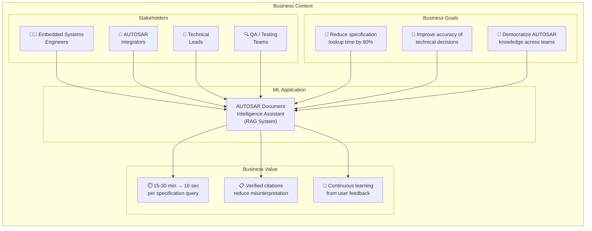

# GR4ML — Business View

## AUTOSAR Document Intelligence Assistant

---

## Business View Diagram

---

## Stakeholder Analysis

| Stakeholder | Role | Pain Point | Expected Benefit |
|-------------|------|-----------|-----------------|
| **Embedded Systems Engineers** | Primary users — query AUTOSAR specs daily during BSW development | Spend 15-30 min per manual lookup across multiple 200+ page PDFs | Instant, precise answers with source citations in < 3 seconds |
| **AUTOSAR Integrators** | Configure BSW modules (Com, NvM, Dem, Os) according to specs | Must cross-reference multiple specifications for configuration parameters | Single query returns all relevant config info with exact page references |
| **Technical Leads** | Review architecture decisions against AUTOSAR compliance | Need to verify that team's implementation matches spec requirements | Quick verification of requirement IDs ([SWS_*]) and their specifications |
| **QA / Testing Teams** | Validate test cases against specification requirements | Manually map test cases to AUTOSAR requirements is tedious | Query requirement IDs to get exact behavioral specifications for test design |

---

## Business Goals → ML Justification

### Goal 1: Reduce Specification Lookup Time by 80%
- **Current State:** 15-30 minutes per query (manual PDF search)
- **Target State:** < 3 seconds per query (automated semantic search + LLM answer)
- **ML Justification:** Semantic search requires **learned vector representations** of text — traditional keyword search cannot understand synonyms, abbreviations, or technical context

### Goal 2: Improve Accuracy of Technical Decisions
- **Current State:** Engineers may miss relevant sections or misinterpret specifications
- **Target State:** Every answer includes verifiable citations with page numbers and section headings
- **ML Justification:** The **re-ranking model** scores relevance more accurately than simple keyword matching, ensuring the most relevant context reaches the LLM

### Goal 3: Democratize AUTOSAR Knowledge
- **Current State:** Deep AUTOSAR knowledge is siloed among senior engineers
- **Target State:** Any team member can query and understand AUTOSAR specifications
- **ML Justification:** The LLM **synthesizes** retrieved information into clear, coherent answers — acting as an always-available AUTOSAR expert

---

## Business Constraints

| Constraint | Impact | Mitigation |
|-----------|--------|-----------|
| **No paid APIs** | Cannot use OpenAI, Claude, etc. | Use Ollama with local open-source models (llama3.2, nomic-embed-text) |
| **Data privacy** | AUTOSAR specs may be under license | All processing is local — no data leaves the system |
| **Hardware limits** | Consumer-grade GPU/CPU | Use quantized models (3B parameter LLM) that run on Apple Silicon |
| **Real-time need** | Engineers need answers during active development | Target < 3s latency with async processing and efficient retrieval |

---

## Success Metrics (Business KPIs)

| KPI | Baseline | Target | Measurement |
|-----|----------|--------|-------------|
| Query Resolution Time | 15-30 min | < 10 sec | Timed comparison study |
| Engineer Satisfaction | N/A | ≥ 80% thumbs-up rate | Feedback analytics |
| Specification Coverage | 0 documents | ≥ 5 AUTOSAR specs | Ingestion tracking |
| Daily Active Queries | 0 | ≥ 20 queries/day | Usage analytics |
