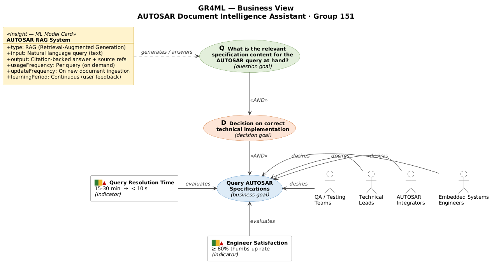

# GR4ML — Business View

## AUTOSAR Document Intelligence Assistant

---

## Business View Diagram

```
┌─────────────────────────────────────────────────────────────────────────────────────────────────────────────────┐
│                                                                                                                 │
│   ████████████████████████                                                                                      │
│   █  Business View      █                                                                                       │
│   ████████████████████████                                                                                      │
│                                                                                                                 │
│                                                    ┌──────╌╌╌╌╌╌──────┐                                         │
│      Query Resolution Time                         │  Query AUTOSAR   │◄── desires ── 🧑 Embedded Systems       │
│      ┌───┬───┐                                     │  Specifications  │               │  Engineers              │
│      │ ■ │   │                                     └──────╌╌╌╌╌╌──────┘                                         │
│      │ ▲ │   │                                            │                           🧑 AUTOSAR                │
│      │ ▲ │ ■ │                                           AND                          │  Integrators            │
│      └───┴───┘                                      ┌─────┴──────┐                                              │
│                                                     │            │                    🧑 Technical              │
│                                                     ▼            ▼                    │  Leads                  │
│  ┌─────────────────────────────┐        ╔════════════════╗   ┌╌╌╌╌╌╌╌╌╌╌╌╌╌╌╌╌╌╌╌┐                              │
│  │ AUTOSAR RAG System          │        ║  D  Decision   ║   │                   │    🧑 QA / Testing           │
│  │ (Insight — ML Model Card)   │        ║    on correct  ║   │   ...             │    │  Teams                  │
│  │─────────────────────────────│        ║    technical   ║   │                   │                              │
│  │ +type: RAG System           │        ║ implementation ║   └╌╌╌╌╌╌╌╌╌╌╌╌╌╌╌╌╌╌╌┘                              │
│  │   (Retrieval-Augmented      │        ╚═══════╤════════╝                                                      │
│  │    Generation)              │                │                                                               │
│  │ +input: Natural language    │               AND                                                              │
│  │   query (text)              │                │                                                               │
│  │ +output: Citation-backed    │                ▼                                                               │
│  │   answer with source refs   │    ╔═══════════════════════════════════════════╗                               │
│  │ +usageFrequency: Per query  │    ║                                           ║                               │
│  │ +updateFrequency: On new    │    ║  Q  What is the relevant specification    ║                               │
│  │   document ingestion        │    ║     content for the AUTOSAR query at      ║                               │
│  │ +learningPeriod: Continuous │    ║     hand?                                 ║                               │
│  │   (user feedback driven)    │    ║                                           ║                               │
│  └──────────┬──────────────────┘    ╚═══════════════════════════════════════════╝                               │
│             │                                     ▲                                                             │
│             │                                     │                                                             │
│             └──── generates ──────────────────────┘                                                             │
│                                        answers                                                                  │
│                                                                                                                 │
└─────────────────────────────────────────────────────────────────────────────────────────────────────────────────┘
```



### Legend for Business View

| Symbol | Element | Description |
|--------|---------|-------------|
| 🧑 (stick figure) | **Actor** | Stakeholder who interacts with or benefits from the system |
| Oval / rounded box | **Business Goal** | High-level organizational objective |
| **D** + oval | **Decision Goal** | A decision that needs to be made using analytics |
| **Q** + oval | **Question Goal** | A question that the ML system must answer |
| Rectangle with attributes | **Insight** | ML model card describing the analytical model |
| Colored bar (■ green / ▲ red) | **Indicator** | KPI that measures goal satisfaction |
| `AND` / `OR` | **Decomposition** | How goals break down into sub-goals |
| `desires →` | **Desires** | Actor wants to achieve a goal |
| `generates` | **Generates** | Insight produces answers to questions |
| `answers` | **Answers** | Question goal is answered by the insight |
| `evaluates` | **Evaluates** | Indicator measures goal satisfaction |
| `influence ++/--` | **Influence** | Positive or negative impact on a goal |

---

## Actors (Stakeholders)

| Actor | Role | Desires |
|-------|------|---------|
| 🧑 **Embedded Systems Engineers** | Primary users — query AUTOSAR specs daily during BSW development | Instant, precise answers with source citations instead of 15-30 min manual lookup |
| 🧑 **AUTOSAR Integrators** | Configure BSW modules (Com, NvM, Dem, Os) according to specs | Single query returns all relevant config info with exact page references |
| 🧑 **Technical Leads** | Review architecture decisions against AUTOSAR compliance | Quick verification of requirement IDs ([SWS_*]) and their specifications |
| 🧑 **QA / Testing Teams** | Validate test cases against specification requirements | Query requirement IDs to get exact behavioral specifications for test design |

All actors **desire →** the business goal: *Query AUTOSAR Specifications*.

---

## Business Goal Decomposition

### Business Goal: Query AUTOSAR Specifications
The top-level business goal decomposes via **AND** into:

1. **Decision Goal (D):** *Decision on correct technical implementation*
   - Engineers need to make implementation decisions based on accurate specification data
   - The system must provide reliable, verifiable answers to support these decisions

2. **Question Goal (Q):** *What is the relevant specification content for the AUTOSAR query at hand?*
   - The core question the ML system answers
   - Requires semantic understanding of both the query and the specification content
   - **Answered by** the AUTOSAR RAG System (Insight)

---

## Insight — ML Model Card

| Attribute | Value |
|-----------|-------|
| **+type** | RAG System (Retrieval-Augmented Generation) |
| **+input** | Natural language query (text string, 3-2000 characters) |
| **+output** | Citation-backed answer with document name, page number, section heading |
| **+usageFrequency** | Per query (on-demand, per instance) |
| **+updateFrequency** | On new document ingestion (when new AUTOSAR specs are added) |
| **+learningPeriod** | Continuous — user feedback (thumbs up/down) is collected for quality monitoring and retrieval analytics via `GET /feedback/analytics` |

The Insight **generates** answers to the Question Goal and **influences** (++) the Decision Goal by providing accurate, cited specification content.

---

## Indicators (Business KPIs)

| Indicator | Current (▲ Red) | Target (■ Green) | Evaluates |
|-----------|-----------------|-------------------|-----------|
| **Query Resolution Time** | 15-30 min (manual PDF search) | < 10 sec (automated semantic search + LLM) | Business Goal: Query AUTOSAR Specifications |
| **Engineer Satisfaction** | N/A | ≥ 80% thumbs-up rate | Question Goal: Answer quality |
| **Specification Coverage** | 0 documents indexed | ≥ 5 AUTOSAR specs ingested | Insight: RAG System completeness |
| **Daily Active Queries** | 0 | ≥ 20 queries/day | Business Goal: Adoption & usage |
| **Citation Accuracy** | N/A | ≥ 90% correct citations | Decision Goal: Reliable decisions |
| **Hallucination Rate** | N/A | < 5% unsupported claims | Decision Goal: Trustworthiness |

---

## Business Goals → ML Justification

### Goal 1: Reduce Specification Lookup Time by 80%
- **Current State:** 15-30 minutes per query (manual PDF search)
- **Target State:** sub-second semantic retrieval for source discovery, followed by local LLM answer generation with measured latency reported in every response
- **ML Justification:** Semantic search requires **learned vector representations** of text — traditional keyword search cannot understand synonyms, abbreviations, or technical context

### Goal 2: Improve Accuracy of Technical Decisions
- **Current State:** Engineers may miss relevant sections or misinterpret specifications
- **Target State:** Every answer includes verifiable citations with page numbers and section headings
- **ML Justification:** The **re-ranking model** scores relevance more accurately than simple keyword matching, ensuring the most relevant context reaches the LLM

### Goal 3: Democratize AUTOSAR Knowledge
- **Current State:** Deep AUTOSAR knowledge is siloed among senior engineers
- **Target State:** Any team member can query and understand AUTOSAR specifications
- **ML Justification:** The LLM **synthesizes** retrieved information into clear, coherent answers — acting as an always-available AUTOSAR expert

---

## Business Constraints

| Constraint | Impact | Mitigation |
|-----------|--------|-----------:|
| **No paid APIs** | Cannot use OpenAI, Claude, etc. | Use Ollama with local open-source models (llama3.2, nomic-embed-text) |
| **Data privacy** | AUTOSAR specs may be under license | All processing is local — no data leaves the system |
| **Hardware limits** | Consumer-grade GPU/CPU | Use quantized models (3B parameter LLM) that run on Apple Silicon |
| **Real-time need** | Engineers need answers during active development | Sub-second retrieval with transparent full-answer latency from local LLM generation |
