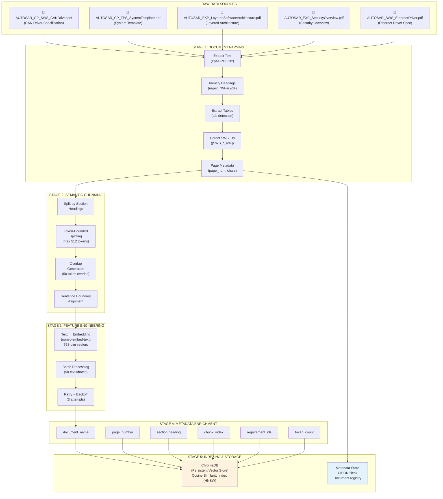

# GR4ML — Data Preparation View

## AUTOSAR Document Intelligence Assistant

---

## Data Preparation View Diagram

---

## Raw Data Characterization

| Document | Size | Pages | Content Type |
|----------|------|-------|-------------|
| AUTOSAR_CP_SWS_CANDriver.pdf | 1.4 MB | ~150 | CAN Driver BSW specification with APIs, configuration, and requirement IDs |
| AUTOSAR_CP_TPS_SystemTemplate.pdf | 27 MB | ~700 | System description template — largest document with complex structure |
| AUTOSAR_EXP_LayeredSoftwareArchitecture.pdf | 2.1 MB | ~100 | Architecture explanation with diagrams and layer descriptions |
| AUTOSAR_EXP_SecurityOverview.pdf | 297 KB | 26 | Security mechanisms overview — compact explanatory document |
| AUTOSAR_SWS_EthernetDriver.pdf | 792 KB | ~80 | Ethernet Driver specification with APIs and configuration |

**Total: ~1,050+ pages of AUTOSAR specifications**

---

## Data Preparation Pipeline

### Stage 1: Document Parsing

**Tool:** PyMuPDF (fitz) — high-performance PDF text extraction

**Extraction targets:**
- **Full text:** All visible text content per page
- **Section headings:** Detected via regex pattern `^(\d+(?:\.\d+)*)\s+(.+)$` (e.g., "7.1.2 Com_Init")
- **Requirement IDs:** Detected via regex pattern `\[SWS_[A-Za-z]+_\d+\]` (e.g., "[SWS_Com_00432]")
- **Table detection:** Heuristic based on tab-separated lines (>10% of lines have ≥2 tabs)
- **Page metadata:** Page number, character count, heading list

**Output:** `ParsedDocument` with list of `ParsedPage` objects

**Code reference:** [parser.py](../app/services/ingestion/parser.py)

### Stage 2: Semantic Chunking

**Strategy:** Two-level semantic splitting

1. **Primary split:** By AUTOSAR section headings
   - Each numbered section (e.g., "7.1.2 Com_Init") becomes a logical boundary
   - This preserves the document's inherent semantic structure

2. **Secondary split:** By token count
   - Sections exceeding `CHUNK_SIZE` (default: 512 tokens) are further split
   - Overlap of `CHUNK_OVERLAP` (default: 50 tokens) between adjacent chunks
   - Sentence boundary alignment: splits prefer to break at periods

**Why this strategy?**
- AUTOSAR documents have well-defined section numbering → natural semantic boundaries
- Section-aware chunking keeps related content together (e.g., an API function and its description)
- Overlap ensures no information is lost at chunk boundaries
- Requirement IDs ([SWS_*]) are preserved within their containing chunk

**Output:** List of `Chunk` objects with text + metadata

**Code reference:** [chunker.py](../app/services/ingestion/chunker.py)

### Stage 3: Feature Engineering (Embedding)

**Model:** `nomic-embed-text` via Ollama
- **Architecture:** Transformer-based text encoder
- **Output:** 768-dimensional dense vectors
- **Similarity space:** Cosine similarity (higher = more similar)

**Processing:**
- Texts are embedded in batches of 50 for efficiency
- Each embedding takes ~10ms on Apple Silicon
- Retry logic with exponential backoff (2s, 4s, 8s) for transient failures
- Total embedding time for a 200-page document: ~2-3 minutes

**Why nomic-embed-text?**
- Runs locally via Ollama (no API costs)
- Strong performance on retrieval benchmarks (MTEB)
- 768 dimensions provide good precision/speed tradeoff
- Supports up to 8192 tokens per input

**Code reference:** [embedder.py](../app/services/ingestion/embedder.py)

### Stage 4: Metadata Enrichment

Each chunk is enriched with metadata for citation generation:

| Metadata Field | Source | Purpose |
|---------------|--------|---------|
| `document_name` | Filename | Identify source document in citations |
| `page_number` | PDF page index | Link to exact page for verification |
| `page_end` | Last page of chunk | Handle multi-page chunks |
| `section` | Detected heading | Show section context in citations |
| `chunk_index` | Sequential counter | Order chunks within a document |
| `total_chunks` | Total chunk count | Context for chunk position |
| `requirement_ids` | SWS regex matches | Enable requirement-level queries |
| `token_count` | Character/4 estimate | Monitor chunk size distribution |

### Stage 5: Indexing & Storage

**Vector Store (ChromaDB):**
- **Index type:** HNSW (Hierarchical Navigable Small World) — approximate nearest neighbor
- **Distance metric:** Cosine distance
- **Persistence:** Disk-backed at `data/chroma_db/`
- **Batch upsert:** Chunks inserted in batches of 500
- **Idempotent:** Re-ingesting a document deletes old chunks first

**Metadata Store (JSON):**
- Tracks document-level metadata: name, page count, chunk count, ingestion time
- Records embedding model version and chunking parameters used
- Stored at `data/metadata/documents.json`

---

## Data Quality Considerations

| Concern | Mitigation |
|---------|-----------|
| **PDF extraction errors** | PyMuPDF handles most layouts; tables may lose structure — mitigated by including raw text |
| **Chunk boundary artifacts** | 50-token overlap ensures context continuity at boundaries |
| **Duplicate content** | Jaccard similarity check (>0.7) during context assembly removes near-duplicate chunks |
| **Empty/boilerplate pages** | Pages with no text content are automatically skipped during parsing |
| **Encoding issues** | UTF-8 encoding enforced throughout the pipeline |
| **Large documents** | The 27MB System Template is chunked into manageable pieces; batch embedding prevents memory overflow |
